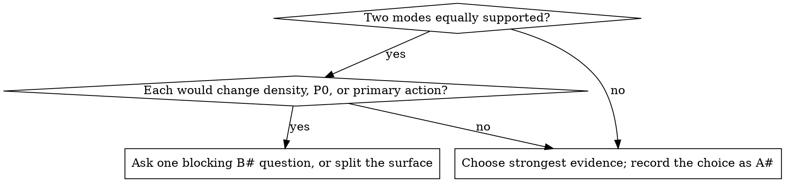
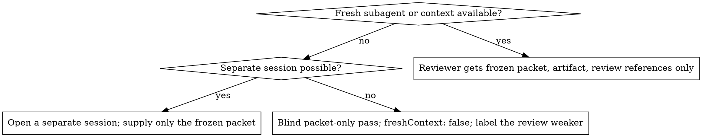

# Workflow and routing

This file is the normative protocol for command routing, durable artifacts, questions, reviewer isolation, and all-host fallback. It is intentionally host-neutral: paths are workspace-relative and no behavior depends on a particular agent, IDE, shell, or environment variable.

## 1. Resolve paths once

Choose the nearest project root that contains the requested target or its source tree. If no project marker or target exists, use the active workspace root. Never write absolute host paths into artifacts.

Derive `<surface-id>` from the requested surface or target basename in kebab case. Prefer a supplied scenario, route, or surface identifier over a derived title slug when one exists. Reuse it for later work. Use `main-surface` only when no meaningful name is available.

```text
.considered/PRODUCT.md
.considered/<surface-id>/FRAME.md
.considered/<surface-id>/STRUCTURE.md
.considered/<surface-id>/CONTRACT.md
.considered/<surface-id>/REVIEW-PACKET.md
.considered/<surface-id>/REVIEW.json
.considered/<surface-id>/DESIGN.md
```

`PRODUCT.md` is shared product context. All other paths are surface-scoped. These files are the durable record when chat state, hooks, comments, preview access, or a prior host disappear.

`LOOP-05` (artifacts must be produced): a command that reports completion without writing its required artifact has not run. `LOOP-02` (compressed chain minimum): even under severe context pressure, the decision, the ranked questions, the tier assignment, and the contract survive. Compress the prose, never drop a link in the chain.

### Contract placement

`.considered/<surface-id>/CONTRACT.md` is the canonical raw contract. When comments are safe, copy the same field values into a top-of-file wrapper in the built artifact. When comments are unsafe, unavailable, stripped by generation, or the target is binary or remote, use the sidecar alone and record that placement in `STRUCTURE.md`, `REVIEW-PACKET.md`, and `REVIEW.json`.

A reviewer and linter use the wrapper when present, otherwise `CONTRACT.md`. The two copies must stay synchronized if both exist.

`CONTRACT-01` (syntax and completeness): every required field is present and parses under the v1 grammar. `LOOP-03` (artifact IDs in code): elements carry their artifact IDs into the built target so a reviewer can trace a rendered element back to the question it answers.

## 2. Question and assumption protocol

First inspect the brief, source, existing artifacts, and available evidence. Then classify each missing fact.

A fact is **blocking** only when a wrong assumption would materially change one of these:

1. the human's primary decision or P0 answer,
2. the sole mode or primary action,
3. destructive, privacy, legal, accessibility, or safety treatment,
4. the requested delivery target or permission to change it.

All other gaps are nonblocking. Record each as `A#` with the assumption, impact, and validation path in `FRAME.md`, then proceed. Examples include an unconfirmed viewport, provisional data latency, tentative tone, unverified frequency, or a plausible secondary object attribute. An assumption is a design input: it shapes structure and behavior but never renders as product copy (`HON-02`), and every claim that does render must trace to a supplied fact (`HON-01`).

`HON-06` (the chain never renders) extends to the skill's own vocabulary: zone tier labels ("DECIDE NOW", "ROUTINE"), lettered zone ids (A/B1/B2/E), framing names, and "View as `<role>`" scaffolding that exists only to demonstrate a state to the reviewer are not user copy. Render the decision the tier encodes — a highlighted card, an order, a divider — and keep the label itself in `STRUCTURE.md`. This scaffolding was independently read as prototype leakage when it surfaced in a built settings surface during evaluation.

For blocking facts, write `B#`, state why it meets the test, and ask one precise question. Batch simultaneous blockers in one numbered request. Do not ask generic discovery questions, and do not ask a question that existing evidence can answer. If an answer is unavailable, mark the affected command `blocked`; do not disguise an invented answer as an assumption. When no answer can arrive at all — a headless or non-interactive run with nothing to pause for — record the question and the assumption taken in the artifact, mark the dependent command `blocked` if that assumption is unsafe, and proceed; never invent the answer. An unrecorded low score is the same defect as an invented answer, and so is an unrecorded question.

A mode is blocking only when two modes are equally supported and each would change density, P0, or primary action. Otherwise choose the strongest evidence and label the choice as an assumption.



Every command ends with exactly these status fields in its human-readable result:

```text
Changed: <workspace-relative paths, or none>
Assumptions: <A ids, or none>
Blockers: <B ids, or none>
Next: <recommended command or requested answer>
```

## 3. Stage x mode x surface routing

Route every request as the tuple:

```text
<stage command> x <one mode> x <surface route>
```

### Stage branch

| Stage | Core reference | Additional reference only when needed |
| --- | --- | --- |
| init | this workflow, `PRODUCT.md` template | existing source and inventory output |
| frame | this workflow, `FRAME.md` template | `ia.md`, `forms.md`, `modes.md` only if evidence is ambiguous |
| structure | this workflow, `STRUCTURE.md` and contract templates | `ia.md`, `hierarchy.md`, `actions.md` |
| compose | this workflow, the structure artifacts, `craft.md`, `accessibility.md` | mode reference, `forms.md`, `states.md`, `actions.md` as triggered by the actual surface |
| critique | review packet template, `critique.md` | failure or state reference after the packet is frozen |
| subtract | this workflow and current review | `failures.md` if diagnosing a named failure |
| harden | this workflow, `states.md`, `accessibility.md` | `actions.md`, `forms.md`, mode reference only where it changes recovery behavior |
| document | this workflow and current durable artifacts | none unless a portability gap is found |

### Mode branch

| Mode | Human goal | Required mode reference | Default surface evidence |
| --- | --- | --- | --- |
| persuade | believe or commit | `persuade.md` | claim, proof, objection handling, one commitment |
| operate | complete accurately | `dense.md` | task object, current state, scoped action, recovery |
| analyze | understand evidence | `dense.md` | finding, comparison, cause, uncertainty, next inquiry |
| read | learn or retrieve | `read.md` | argument, reading path, definitions, continuity |
| experience | encounter or feel | `experience.md` | authored sequence, work-first focus, restrained controls |

### Surface branch

| Surface route | Use when | Required handling |
| --- | --- | --- |
| page | one independently navigable view | Run the full chain and give it one P0 and one mode. |
| flow | a bounded multi-step task or form | Map steps, entry, exit, recovery, and per-step action scope. Read `forms.md`. |
| component | a reusable or embedded unit | Inherit the parent product, mode, and hierarchy. Create its own FRAME and CONTRACT only if it owns an independent decision or primary action. Otherwise document its parent link in `STRUCTURE.md`. |
| existing | an implemented page, flow, or component is being changed or audited | Read the target and inventory before changing it. Preserve proven system conventions unless the request explicitly redesigns them. Use a comment wrapper if safe, otherwise a sidecar. |

`specification-only` is a delivery variant of any route. It writes the same `.considered/` artifacts and a portable layout/state specification rather than source code. `review-only` runs `critique` without changing the target.

## 4. Exact command protocol

Commands run in order unless a command states how it reconstructs a missing earlier artifact. A command may read artifacts created by earlier work, but it must not silently rewrite their decision record.

`LOOP-01` (no code before the gate): do not build the target before `structure` has produced its zones, tiers, and contract. Composition without a committed structure is the failure this whole chain exists to prevent.

The canonical CLI for every command below is `node <skill-dir>/bin/considered.mjs <utility> …` (`roll`, `lint`, `contract`, `gate`, `inventory`, `validate`, …). The dispatcher runs the native engine when `considered-rs` is on `PATH` or `$CONSIDERED_RS_BIN` names it, and falls back to the Node scripts otherwise; output is identical either way. Running `scripts/*.mjs` directly is still valid.

| Command | Required input | Read in order | Required output | Block only when |
| --- | --- | --- | --- | --- |
| `init` | brief or product request; workspace root; optional source target | current `PRODUCT.md` if present, brief, existing source and inventory evidence if present | updated `.considered/PRODUCT.md` with evidence, constraints, assumptions, blockers | no writable artifact root, or the requested product/delivery cannot be identified even provisionally |
| `frame` | product context, requested surface or target, user request | `PRODUCT.md`, relevant target if it exists, this workflow, mode evidence, `forms.md` for flows | `FRAME.md` with brief score, decision, one mode, surface route, dashboard type where it applies, Q inventory, object model, assumptions, blockers | equally supported routes would materially change P0, action, safety, or delivery and evidence cannot resolve them |
| `structure` | ready FRAME, product context, target or specification delivery | `PRODUCT.md`, `FRAME.md`, target and inventory evidence if existing, `ia.md`, `hierarchy.md`, `actions.md`, selected hand | `STRUCTURE.md`, canonical `CONTRACT.md`, assigned hand and reproduction record | an unresolved FRAME blocker affects decision, mode, P0, action risk, or target ownership |
| `compose` | ready structure and contract; writable target for code delivery | `PRODUCT.md`, `FRAME.md`, `STRUCTURE.md`, `CONTRACT.md`, target source, selected mode reference, triggered form/action/state references | changed target or portable spec; contract wrapper when safe; updated structural state plan | requested code delivery has no identifiable writable target and no specification-only fallback is accepted |
| `critique` | inspectable artifact plus current durable chain | build context reads `PRODUCT.md`, `FRAME.md`, `STRUCTURE.md`, `CONTRACT.md`, target, lint evidence; fresh reviewer reads only frozen `REVIEW-PACKET.md`, artifact, and review references | frozen `REVIEW-PACKET.md`, independent `REVIEW.json`, gate, fix list, limitations | no inspectable artifact or source exists; absent render evidence limits visual, responsive, and render accessibility claims rather than inventing them |
| `subtract` | built or specified surface and current contract; review if available | `FRAME.md`, `STRUCTURE.md`, `CONTRACT.md`, target, `REVIEW.json` if present | removal-only target/spec change; updated `DELETED`; stale review marker | no artifact, specification, or candidate element exists to remove |
| `harden` | built or specified surface, state and action inventory | `FRAME.md`, `STRUCTURE.md`, target, `states.md`, `actions.md`, `forms.md` for flows | state behavior and edge-case changes; updated state plan; stale review marker | unknown action risk, legal requirement, or safety treatment would make recovery behavior unsafe |
| `document` | current durable chain and target or specification | `PRODUCT.md`, `FRAME.md`, `STRUCTURE.md`, `CONTRACT.md`, latest `REVIEW.json`, final artifact/specification | `.considered/<surface-id>/DESIGN.md` with portable system, states, route, and review status | no target or specification exists to document |

### `init`

1. Resolve root and optional source target.
2. Inspect existing product context and design-system evidence before adding claims.
3. Write only reusable product facts to `PRODUCT.md`.
4. If the available evidence would leave `PRODUCT.md` substantially empty, ask one numbered batch of objective questions before writing it: what decision does this product serve, who decides, and what changes if it works. Use the host's structured question interface when one exists; otherwise print the batch as plain numbered text and label it `questions: text` per §5. Record whatever comes back as evidence, not as inference.
5. Mark unknown but safe facts as `A#`; ask only blocking `B#` questions.
6. Recommend `frame` for a named surface.

### `frame`

1. Score the brief before designing anything. Use the eight-dimension rubric in the `FRAME.md` template: human, decision, consequence, frequency, success measure, scope, constraints, current state, each 0, 1, or 2, for a total out of 16. Record every dimension score and the total in `FRAME.md`. A total of 8 or more proceeds to step 2; remaining gaps are classified by the §2 protocol as usual. A total below 8 runs the brief gate loop first.
2. Reuse product facts. Inspect the existing target before inferring behavior.
3. State one decision and choose one mode from evidence. If a surface has two equal consequential outcomes, ask the blocking mode question or split it.
4. When the mode is operate or analyze and the surface is a dashboard or data workspace, declare its dashboard type: operational, analytical, strategic, or embedded. The type sets the module budget enforced by `DASH-03` and must not be mixed in one view.
5. Create six to twelve user-voice questions when the surface is broad; use a compact set for a focused component. Give each a decision, frequency, and P0 to P4 tier.
6. Build the object model and tag every candidate element to a question. Delete or disclose orphans.
7. Write assumptions and blockers. Do not wait on nonblocking gaps.

#### Brief gate loop

A brief below 8 is not a design problem yet. The first deliverable against it is a question set. Designing against an unscored or weak brief is the largest single source of expensive rework, so this loop is collaborative and it repeats.

1. Present the total, the dimensions that scored 0 or 1, and what each missing fact would change.
2. Ask the highest-leverage unanswered questions as one numbered batch, ordered by the score gap they close. Ask at most three at a time. Use the host's structured question interface when one exists; otherwise print the batch as plain numbered text and label it `questions: text` per §5.
3. Incorporate the answers into `FRAME.md` and re-score every affected dimension.
4. Repeat until the total reaches 8 or the user explicitly says to proceed. If the user says proceed below 8, record `brief-score: <n>/16 (user-accepted)` in `FRAME.md` and carry each 0-scored dimension as an `A#` with its impact and validation path.
5. Never design below 8 silently. An unrecorded low score is the same defect as an invented answer.

The loop does not change the §2 classification test. Brief-score questions are asked because the brief is not yet designable; blocking `B#` questions are asked because one specific fact would change the decision, mode, safety treatment, or delivery. A blocker still blocks at any score.

### `structure`

1. Stop if a FRAME blocker changes the decision or safety posture.
2. Run `node <skill-dir>/bin/considered.mjs roll --mode <mode>` when available. Record the structure ids, direction id, key, and generation (`ROLL-01`, assigned roll provenance). Present the assigned hand once; rerolls chain from the same key.
3. Map zones by question and object, then assign P0 to P4 and action scope/tier/risk.
4. Write `STRUCTURE.md` and the raw canonical `CONTRACT.md` before composition.
5. Validate the contract with `node <skill-dir>/bin/considered.mjs contract .considered/<surface-id>/CONTRACT.md` when the helper exists. Resolve contract findings before `compose` if they affect P0, mode, action safety, or traceability.

### `compose`

1. Read the canonical chain and only the route-specific references. Do not load reviewer catalogs.
2. Preserve an existing system unless redesign is requested. Implement P0 first, then P1, then P2. Keep P3 disclosed and P4 peripheral. Build through the token and component layers in `craft.md`; never style at the view level.
3. Build the requested source target. For specification-only delivery, write a concrete layout, action, and state specification in `STRUCTURE.md` or `DESIGN.md`.
4. Copy the contract into the target's correct comment wrapper when safe. Otherwise record sidecar-only placement.
5. Run available contract/source checks — `node <skill-dir>/bin/considered.mjs contract <target>` and `node <skill-dir>/bin/considered.mjs lint <path>` — as evidence, not as mid-build design instructions. Mark state for `critique`.

### `critique`

1. The builder freezes `REVIEW-PACKET.md` with current product, frame, structure, raw contract, target, preview, and check evidence. It excludes build rationale.
2. Start a fresh reviewer context that has not seen the builder's reasoning. Give it the packet, artifact, and reviewer references only.
3. The reviewer runs `references/critique.md` in pass order, records evidence-bound findings, and writes `REVIEW.json`. Combine the check evidence with the review via `node <skill-dir>/bin/considered.mjs gate <report.json...> --review .considered/<surface-id>/REVIEW.json`.
4. If a fresh reviewer cannot be created, start a separate conversation or session and supply only the packet. If that is impossible, make a blind packet-only pass, set `freshContext: false`, and label the review weaker.
5. If no render exists, review source or specification but mark visual, responsive, and render accessibility checks `blocked`; do not claim a visual gate passed.



The ladder never rises: a weaker review is labeled, not upgraded, and no rung claims the confidence of the rung above it.

### `subtract`

1. Remove only. Do not add components, copy, controls, or visual treatment.
2. Start with elements that fail the question trace, compete with P0, duplicate another element, or belong in disclosure.
3. Update the deleted list and contract if structure changes (`LOOP-04`, declare deletions: a removal is recorded, never silent). Mark any prior review stale.
4. Return to `critique` when a removal changes hierarchy or action scope.

### `harden`

1. Specify loading, empty-first-use, empty-filtered, partial, stale, error, no-permission, and too-much-data behavior for every data region.
2. Verify zero, one, many, very many, negative, null, and long strings.
3. Specify default, hover, focus, active, loading, disabled, success where relevant, and error behavior for each action.
4. Ask only when unknown risk or a regulated/accessibility constraint would make a safe treatment impossible to infer. Otherwise record an assumption and implement the conservative reversible path.
5. Mark review stale and route to fresh `critique`.

### `document`

1. Consolidate the current system into `DESIGN.md`: decision, route, P0 to P4, zones, actions, components or tokens, states, responsive behavior, contract location, assumptions, and current review gate.
2. Link only workspace-relative paths. Never require chat history or a host-specific feature to reuse the record.
3. Distinguish verified facts from assumptions and note review limitations.

## 5. Portable all-host fallback

The artifacts and command semantics do not require slash commands, a particular IDE, or a privileged agent host.

| Missing capability | Fallback | Required label |
| --- | --- | --- |
| Slash commands or router | Treat `considered <command>` in natural language as the explicit stage and follow this file. | `router: manual` |
| Structured question UI | Print the blocking questions as one numbered batch and wait only for those answers. | `questions: text` |
| Shell or Node helper | Make one unbiased selection per roll layer from eligible deck entries in file order: first `assets/decks/structures.json` (one pick per tier, in tier order `organizing-axis`, `depth-strategy`, `framing`), then `assets/decks/directions.json` (one pick). Generate one `cns-` key, record selected ids, method `host-fallback`, and generation. Never shortlist, score, or reselect by taste. | `roll method: host-fallback` |
| Editable source comments | Store the raw contract in `CONTRACT.md` and set contract placement to `sidecar`. | `contract placement: sidecar` |
| Source target | Produce a specification-only route with the same durable artifacts. | `delivery: specification-only` |
| Subagent or fresh context | Open a separate session with only the frozen packet. If impossible, run a blind packet-only pass and set `freshContext: false`. | `fresh context limitation` |
| Browser or screenshot | Perform source-only or specification-only review; visual, responsive, and render accessibility gates are blocked. | `review scope limitation` |
| Check scripts | Manually inspect against the contract and state the checker was unavailable. Never claim a script passed. | `check: blocked` |

The fallback preserves the decision chain and its limitations. It does not invent evidence or claim equivalent review confidence.
